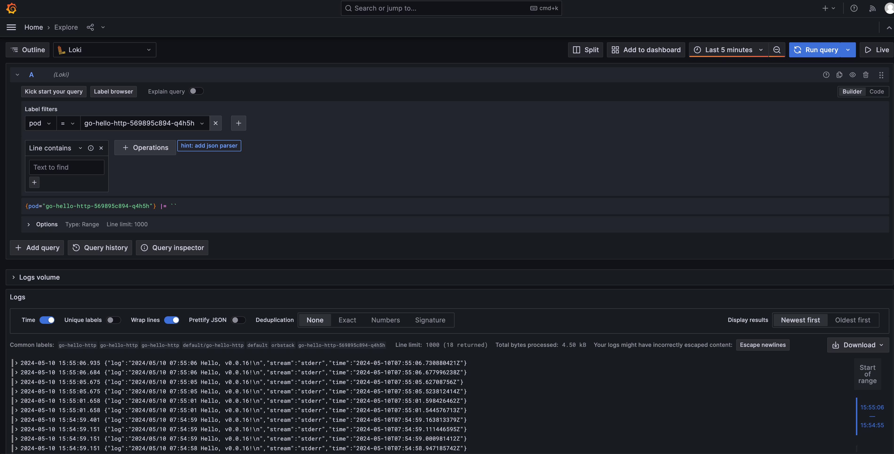

# chart-merico-test

## k8s test cluster

### 由于minikube在macOS本地运行效率太低，我在本地使用了orbstack替代 https://orbstack.dev/

### 使用minikube初始化环境的方式如下
- `brew install minikube`
- `minikube start`

## helm chart

### 创建本地chart
- 创建helm项目 `helm create go-hello-http`
- 部署 `helm install go-hello-http ./go-hello-http`
- 映射本机端口验证部署 `kubectl port-forward svc/go-hello-http 8080:80`
- 访问 `http://localhost:8080`

## Loki

### 安装

- `helm repo add grafana https://grafana.github.io/helm-charts`
- `helm repo update`
- `helm install loki grafana/loki-stack -f loki-values.yaml`

### 查看应用日志

- 映射本地端口 `kubectl port-forward svc/loki-grafana 3000:80`
- 访问 `http://localhost:3000` 
- 用户名密码默认都是admin，生产部署避免直接使用弱密码
- 跳到Explorer菜单，查询应用日志

